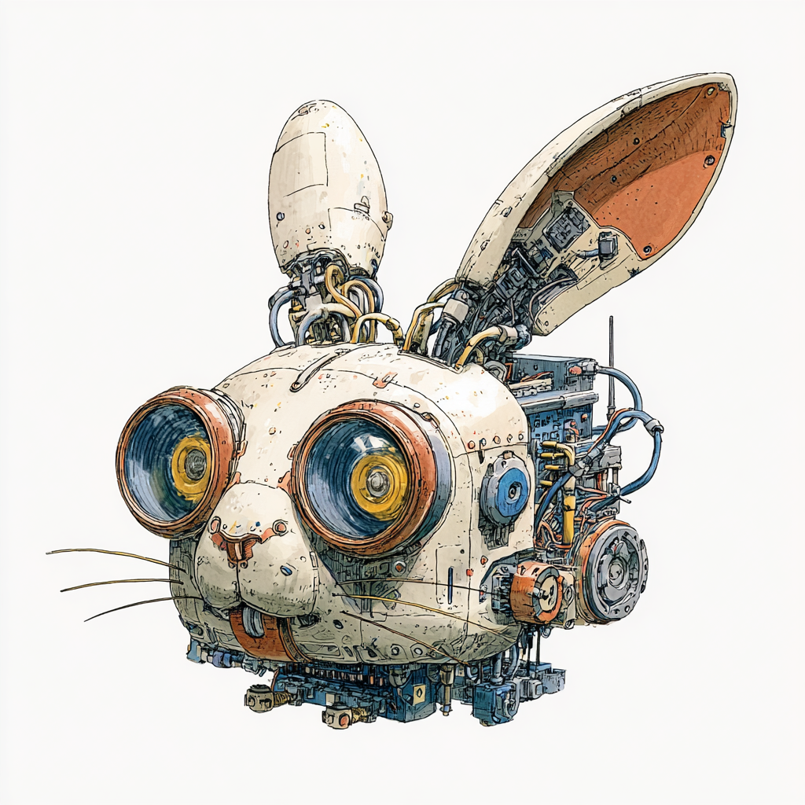
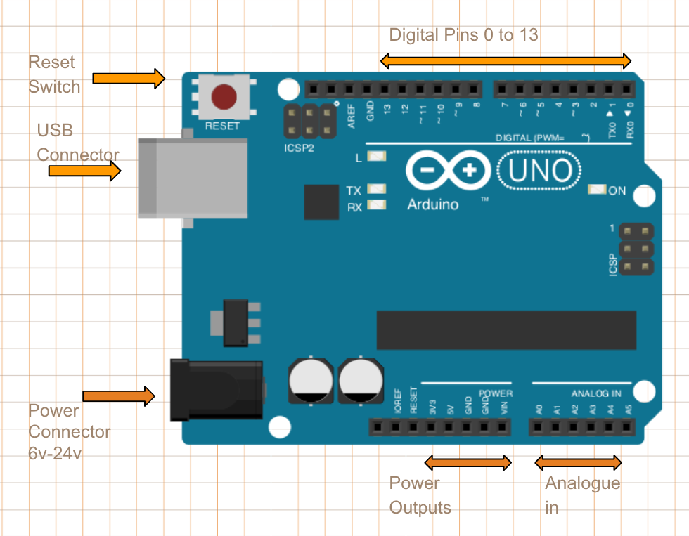
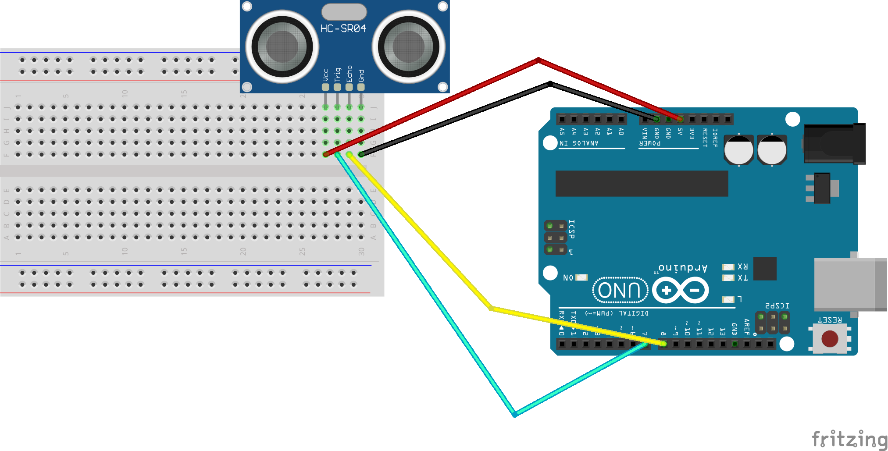

<!-- _color: orange -->
# 🥕🥕🥕🥕Sketching with Technology - Signals <!--fit-->
---

# Signal Processing with Arduino
## Filtering Techniques for the HC-SR04 Ultrasonic Sensor

8 October, 2025


---
# Agenda
#### KL 10:00-12:00
1. Signal Processing worksheet
2. Discussion about how to apply
3. Fritzing
#### LUNCH 🥪
#### KL 13:00-15:00
1. Give Get Session
2. Project discussions
3. General things

---
<style scoped>
  .top-title h1 {
    position: absolute;
    top: 0;
    width: 100%;
    text-align: center;
    font-size: 2em;
    margin: 0;
  }
</style>

<!-- Slide with a custom title style -->
<div class="top-title">

# Arduino Board

</div>

---

<style scoped>
  .top-title h1 {
    position: absolute;
    top: 0;
    width: 100%;
    text-align: center;
    font-size: 2em;
    margin: 0;
  }
</style>

<!-- Slide with a custom title style -->
<div class="top-title">

# Wire up the SR-04


</div>

---

# What is Signal Processing?

Signal processing is the manipulation of signals to:
- **Remove noise** and unwanted components
- **Extract information** from raw measurements
- **Enhance features** of interest
- **Prepare data** for analysis or control

**Real-world signals are messy!**
- Electrical noise
- Sensor jitter
- Environmental interference
- Random fluctuations

---

# The HC-SR04 Ultrasonic Sensor

**How it works:**
- Sends ultrasonic pulse (40 kHz)
- Measures echo return time
- Calculates distance: `distance = (duration × 0.0343) / 2`

**Common problems:**
- ❌ Noisy readings (random spikes)
- ❌ Occasional outliers
- ❌ High-frequency jitter
- ❌ Slow drift over time

**Solution:** Apply appropriate filters! ✅

---

# Filter Types Overview

| Filter Type | Purpose | Use Case |
|------------|---------|----------|
| **Low-Pass** | Keep slow changes, block fast noise | Smoothing |
| **High-Pass** | Keep fast changes, block DC/drift | Motion detection |
| **Band-Pass** | Keep specific frequency range | Periodic signal extraction |
| **Median** | Remove outliers/spikes | Spike suppression |
| **Moving Average** | Smooth signal by averaging | General noise reduction |
| **Hysteresis** | Prevent rapid switching | Threshold detection |

---

# Low-Pass Filter
## Smoothing and Noise Reduction

**What it does:**
- ✅ PASSES: Low frequencies (slow changes)
- ❌ BLOCKS: High frequencies (fast noise)

**Specifications:**
- Sampling rate: 10 Hz
- Cutoff frequency: 1.0 Hz
- Order: 4 (Butterworth IIR)
- Implementation: 2 cascaded biquads

---

# Low-Pass Filter - Behavior

```
Input signal:    ~~~∿∿∿~~~∿∿∿~~~   (wavy with noise)
Low-pass output: ―――――――――――――――   (smooth trend)
```

**Frequency domain:**
- Changes slower than 1 Hz → Passed through
- Changes faster than 1 Hz → Attenuated

**Example:**
```
Input:  [10, 12, 50, 11, 13, 12]  (spike at 50)
Output: [10, 11, 18, 16, 14, 13]  (smoothed)
```

---

# High-Pass Filter
## Motion and Change Detection

**What it does:**
- ❌ BLOCKS: Low frequencies (DC offset, drift)
- ✅ PASSES: High frequencies (fast changes)

**Think of it as a "change detector":**
- Constant value → output goes to zero
- Slow drift → small output
- Rapid change → large output

---

# High-Pass Filter - Behavior

```
Input signal:    ___/‾‾‾‾‾‾\___    (ramp up, hold, ramp down)
High-pass out:   ___/⌃_____⌄___    (only the changes!)
```

**Output shows direction:**
- Positive output = moving away (increasing distance)
- Zero output = stationary
- Negative output = moving closer (decreasing distance)

**Complementary relationship:**
`Input ≈ Low-pass output + High-pass output`

---

# Band-Pass Filter
## Isolating Specific Frequencies

**What it does:**
- ❌ BLOCKS: Low frequencies (< 0.5 Hz)
- ✅ PASSES: Middle frequencies (0.5 - 1.5 Hz)
- ❌ BLOCKS: High frequencies (> 1.5 Hz)

**Conceptually:**
```
Input → [High-pass at 0.5 Hz] → [Low-pass at 1.5 Hz] → Output
        ↓ Removes DC/drift        ↓ Removes high noise
```

---

# Band-Pass Filter - Applications

**Perfect for detecting periodic motion:**

| Scenario | Output |
|----------|--------|
| No motion (0 Hz) | ≈ 0 (DC blocked) |
| Slow drift (0.1 Hz) | Small (blocked) |
| Rhythmic motion (1 Hz) | **LARGE** (in passband!) |
| Rapid tapping (3+ Hz) | ≈ 0 (too high) |

**Real-world uses:**
- Heart rate monitoring (0.5-3 Hz) & Breathing detection (0.1-0.5 Hz)
- Vibration analysis at specific frequencies

---

# Median Filter
## Outlier and Spike Removal

**Non-linear filter** that finds the middle value:

```
Window of 3 samples: [10, 100, 12]
Sorted: [10, 12, 100]
Median: 12 ✓ (spike removed!)
```

**How it works:**
1. Store last 3 samples: [a, b, c]
2. Sort them to find middle value
3. Return median, shift buffer

---

# Median Filter - Example

```
Input:  [10, 100, 12, 11, 95, 13]  (100 and 95 are spikes)
Output: [10,  10, 12, 12, 12, 13]  (spikes removed!)
```

**Advantages:**
- ✅ Removes single-sample spikes instantly
- ✅ Preserves sharp edges and steps
- ✅ Non-linear (better for outliers)

**Compare to Moving Average:**
- Moving Average: Smooths everything (blurs spikes)
- Median: Removes outliers while keeping signal shape

---

# Moving Average Filter
## Simple Smoothing by Averaging

**Maintains a sliding window of recent samples:**

```
Window size: 5 samples
Samples: [10, 12, 11, 13, 14]
Output: (10+12+11+13+14) / 5 = 12.0
```
**Implementation:**
- Circular buffer stores recent readings & Running total for efficiency
- When new sample arrives:
  1. Subtract oldest value & Add new value
  2. Divide by window size

---

# Moving Average - Trade-offs

**Larger window (e.g., 10 samples):**
- ✅ Smoother output
- ✅ Better noise reduction
- ❌ Slower response
- ❌ More memory

**Smaller window (e.g., 3 samples):**
- ✅ Faster response
- ✅ Less memory
- ❌ Noisier output
- ❌ Less smoothing

**Choose based on your application needs!**

---

# Hysteresis Filter
## Preventing Rapid State Switching

**Problem:** Simple threshold causes rapid on/off switching
```
Threshold at 30cm:
Distance: 31 → 29 → 31 → 30 → 29 → 31
Output:   OFF  ON   OFF  OFF  ON   OFF  ← Unstable!
```

**Solution:** Use two thresholds (hysteresis)
```
Lower: 20cm, Upper: 40cm
Distance: 50 → 30 → 25 → 15 → 20 → 30 → 50
State:    FAR  FAR  FAR  CLOSE CLOSE CLOSE FAR
```

The "dead zone" between 20-40cm prevents oscillation!

---

# Hysteresis - Real-World Analogy

**Thermostat example:**
- Set temperature: 20°C
- Turn heater ON when temp drops below 19°C
- Turn heater OFF when temp rises above 21°C

**Without hysteresis:**
- Temperature hovers at 20°C
- Heater rapidly cycles on/off & Wears out equipment

**With hysteresis:**
- Stable operation
- Heater stays on until 21°C reached, Then stays off until 19°C

---

# Butterworth IIR Filters
## Understanding the Implementation

**IIR (Infinite Impulse Response):**
- Uses feedback (previous outputs affect current output)
- Very efficient (minimal memory)
- Based on analog filter designs

**Butterworth characteristics:**
- "Maximally flat" frequency response
- No ripples in passband
- Smooth rolloff

---
# Butterworth IIR Filters
## Understanding the Implementation

**Order 4 implementation:**
- 2 cascaded biquads (second-order sections)
- Each biquad has state variables `z1`, `z2`

---

# Biquad Structure

**Each biquad section:**
```cpp
{
  static float z1, z2; // filter state (memory)
  float x = output - a1*z1 - a2*z2;  // feedback
  output = b0*x + b1*z1 + b2*z2;      // feedforward
  z2 = z1;
  z1 = x;
}
```

**Coefficients determine filter behavior:**
- `a1, a2`: Feedback (poles)
- `b0, b1, b2`: Feedforward (zeros)
- Generated using scipy.signal.butter()

---

# FilterDemos.ino - Overview I
## Comprehensive Signal Processing Demonstration

**Main features:**
- Reads HC-SR04 sonar at 10 Hz
- Applies multiple filters simultaneously
- Demonstrates various processing techniques
- Outputs data for Serial Plotter visualization
  
---
# FilterDemos.ino - Overview II
## Comprehensive Signal Processing Demonstration

**Processing pipeline:**
1. Read raw sensor (ping time in µs)
2. Suppress zero values (no-ping condition)
3. Apply 3-sample median filter
4. Convert to centimeters
5. Apply all filter types (low/high/band-pass/band-stop)
6. Calculate derivatives and trajectory fits

---


# FilterDemos.ino - Advanced Features I
## Beyond Basic Filtering

**Additional capabilities:**

**1. Statistical tracking:**
- Running average and variance
- Min/max values
- Sample count

---
# FilterDemos.ino - Advanced Features II
## Beyond Basic Filtering

**2. Ring buffer operations:**
- 10-sample history
- Finite difference derivatives (velocity estimation)
- Median filter over buffer

**3. Trajectory fitting:**
- Quadratic curve fitting (Savitzky-Golay)
- Estimates: position, velocity, acceleration
- Smooth parameter estimation over time

---

# Summary

**Choose the right filter for your application:**

- 📊 **Smooth noisy data** → Low-pass or Moving Average
- 🎯 **Detect motion/changes** → High-pass
- 🎵 **Extract periodic signals** → Band-pass
- ⚡ **Remove spikes** → Median
- 🎚️ **Stable threshold detection** → Hysteresis

**All filter code generated by `filter_gen.py` using:**
- Python + SciPy
- Butterworth design
- Second-order sections (biquads)

**Experiment with different filters to understand their behavior!**

---

# Resources

**Files in this collection:**
- `filter_gen.py` - Generate custom filters
- `sr_04_*.ino` - Individual filter examples
- `FilterDemos.ino` - Complete demonstration
- Frequency response plots (PNG images)

**Key parameters to adjust:**
- Sampling rate (10 Hz default)
- Cutoff frequency (1.0 Hz default)
- Filter order (4 = steeper rolloff)
- Window size (for moving average/median)

**Experiment and visualize with Arduino Serial Plotter!**
